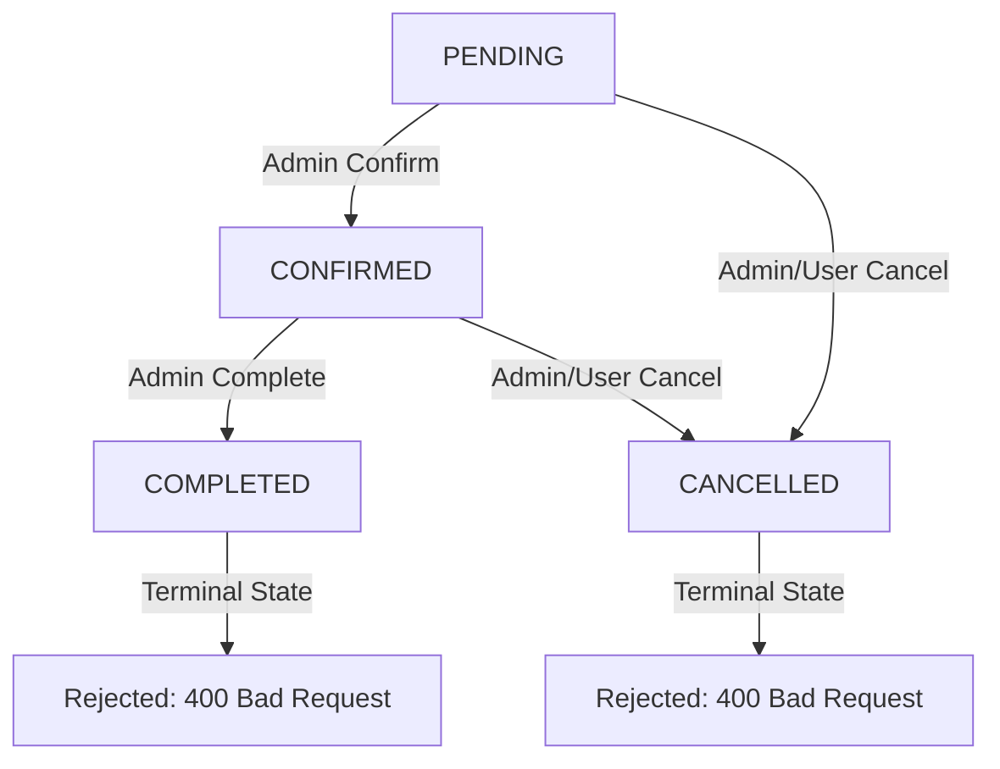

# Phase 8F — Admin Booking Management Documentation

## Overview
Phase 8F implements **Admin Booking Management** for the Travellow platform. This module allows platform administrators to monitor, search, filter, inspect, and update the status of hotel and local guide bookings across destinations while strictly enforcing server-side authorization, valid status lifecycle transitions, historical financial protection, and user data privacy.

---

## 1. Files Created & Modified

### Files Created
- [`app/api/admin/bookings/route.js`](file:///C:/MCA/Mini/Travellow/app/api/admin/bookings/route.js) — Secure GET API for paginated booking records, multi-target search, filters (type, status, destination), sorting, safe user projections, and real MongoDB statistics.
- [`app/api/admin/bookings/[id]/route.js`](file:///C:/MCA/Mini/Travellow/app/api/admin/bookings/%5Bid%5D/route.js) — Secure GET single booking API, PATCH status update API (with transition rules and financial data protection), and disabled hard DELETE endpoint.
- [`components/admin/bookings/BookingDetailModal.js`](file:///C:/MCA/Mini/Travellow/components/admin/bookings/BookingDetailModal.js) — Reusable modal displaying customer profile, service specifications (hotel stay or guide tour), destination info, and financial total.
- [`components/admin/bookings/BookingStatusModal.js`](file:///C:/MCA/Mini/Travellow/components/admin/bookings/BookingStatusModal.js) — Reusable modal for updating booking status with transition safeguards and confirmation prompts.
- [`app/admin/bookings/page.js`](file:///C:/MCA/Mini/Travellow/app/admin/bookings/page.js) — Admin Booking Management page featuring top statistics cards, search bar, filter controls, desktop data table, responsive mobile cards, and pagination.
- [`PHASE8F_BOOKING_ADMIN.md`](file:///C:/MCA/Mini/Travellow/PHASE8F_BOOKING_ADMIN.md) — Technical documentation and audit report for Phase 8F.

### Files Modified
- [`app/admin/AdminClientLayout.js`](file:///C:/MCA/Mini/Travellow/app/admin/AdminClientLayout.js) — Updated sidebar navigation link so `Bookings` routes directly to `/admin/bookings`.

---

## 2. API Endpoints Summary

| Method | Endpoint | Description | Role Required | Status Codes |
|---|---|---|---|---|
| **GET** | `/api/admin/bookings` | List bookings with search, filters (type, status, destination), sorting, pagination & statistics | `ADMIN` | `200`, `401`, `403`, `500` |
| **GET** | `/api/admin/bookings/[id]` | Fetch single booking with populated safe user, hotel, guide & destination details | `ADMIN` | `200`, `400`, `401`, `403`, `404`, `500` |
| **PATCH** | `/api/admin/bookings/[id]` | Update booking status (`PENDING`, `CONFIRMED`, `COMPLETED`, `CANCELLED`) with transition rules | `ADMIN` | `200`, `400`, `401`, `403`, `404`, `500` |
| **DELETE**| `/api/admin/bookings/[id]` | Disabled endpoint returning data preservation notice | `ADMIN` | `409` |

---

## 3. Booking Status Lifecycle & Transition Rules

Existing Statuses: `PENDING`, `CONFIRMED`, `COMPLETED`, `CANCELLED`.

### Valid Server-Side Status Transition Matrix



- **Allowed Transitions:**
  - `PENDING` $\rightarrow$ `CONFIRMED`, `CANCELLED`
  - `CONFIRMED` $\rightarrow$ `COMPLETED`, `CANCELLED`
- **Forbidden Transitions (Rejected with `400 Bad Request`):**
  - `CANCELLED` $\rightarrow$ `CONFIRMED` or `COMPLETED`
  - `COMPLETED` $\rightarrow$ `CONFIRMED` or `CANCELLED`

---

## 4. Strict Financial & Historical Data Protection

To preserve platform financial and audit integrity:
- **`totalAmount`**, **`currency`**, **`user`**, **`hotel`**, **`guide`**, **`destination`**, **`bookingType`**, and **`createdAt`** are **IMMUTABLE** post-creation.
- Client or admin attempts to modify financial amounts or target references via `PATCH /api/admin/bookings/[id]` are strictly blocked on the server with `400 Bad Request`.
- **Hard Deletion Disabled (`409 Conflict`):** Bookings cannot be deleted from the database. This ensures historical revenue analytics, user booking history, and review dependencies remain intact.

---

## 5. User Data Protection & Projections

When populating customer records:
- **Exclusion:** User passwords, password hashes, session tokens, and auth secrets are **NEVER** retrieved or returned.
- **Projections:** Database queries explicitly select safe fields: `.populate("user", "name email phone country profileImage")`.

---

## 6. Compatibility Verification

- **Admin Dashboard Integration (`/api/admin/stats`):** Booking statistics dynamically count real MongoDB records. Status transitions (e.g. `PENDING` $\rightarrow$ `CONFIRMED`) automatically update dashboard tallies.
- **User Dashboard Compatibility (`/dashboard`):** User booking views read directly from the `Booking` collection; admin status updates are reflected immediately in the user's "My Bookings" section.
- **Public Booking Creation (`/api/bookings`):** Hotel and Guide booking modals and endpoints continue to calculate prices using MongoDB model rates without interference.

---

## 7. Automated Testing Results

Automated test script (`scratch/test-admin-bookings.mjs`) evaluated 31 test assertions across authorization, search, filters, projections, status transitions, financial protections, and deletion blocks:

```text
==========================================
STARTING PHASE 8F ADMIN BOOKING MANAGEMENT TESTS
==========================================
✓ Connected to MongoDB Atlas.

--- 1. AUTHORIZATION TESTS ---
  ✓ PASS: Unauthenticated GET /api/admin/bookings returns 401
  ✓ PASS: USER role GET /api/admin/bookings returns 403
  ✓ PASS: LOCAL_GUIDE role GET /api/admin/bookings returns 403
  ✓ PASS: ADMIN role GET /api/admin/bookings returns 200
  ✓ PASS: GET /api/admin/bookings returns bookings array
  ✓ PASS: GET /api/admin/bookings returns stats object

--- 2. READ & SEARCH & SECURITY PROJECTION TESTS ---
  ✓ PASS: Search by user name returns matching bookings
  ✓ PASS: Search by user email returns matching bookings
  ✓ PASS: BookingType=HOTEL filter returns only hotel bookings
  ✓ PASS: Status=PENDING filter returns only pending bookings
  ✓ PASS: Pagination metadata includes valid page and totalPages
  ✓ PASS: User password/hash is not present in populated booking response

--- 3. DETAIL ENDPOINT TESTS ---
  ✓ PASS: Valid booking ID GET /api/admin/bookings/[id] returns 200
  ✓ PASS: Returned booking details match target
  ✓ PASS: Single booking user object excludes password
  ✓ PASS: Invalid ObjectId GET /api/admin/bookings/[id] returns 400
  ✓ PASS: Nonexistent booking ID GET /api/admin/bookings/[id] returns 404

--- 4. STATUS TRANSITION TESTS ---
  ✓ PASS: PATCH PENDING -> CONFIRMED succeeds (200)
  ✓ PASS: Booking status updated to CONFIRMED in DB
  ✓ PASS: PATCH CONFIRMED -> COMPLETED succeeds (200)
  ✓ PASS: Booking status updated to COMPLETED in DB
  ✓ PASS: PATCH PENDING -> CANCELLED succeeds (200)
  ✓ PASS: Booking status updated to CANCELLED in DB

--- 5. INVALID STATUS TRANSITION TESTS ---
  ✓ PASS: CANCELLED -> CONFIRMED transition rejected (400)
  ✓ PASS: CANCELLED -> COMPLETED transition rejected (400)
  ✓ PASS: COMPLETED -> CONFIRMED transition rejected (400)
  ✓ PASS: COMPLETED -> CANCELLED transition rejected (400)

--- 6. FINANCIAL & DATA PROTECTION TESTS ---
  ✓ PASS: Attempting to modify totalAmount returns 400 Bad Request
  ✓ PASS: Attempting to modify currency returns 400 Bad Request
  ✓ PASS: Attempting to modify user reference returns 400 Bad Request

--- 7. HARD DELETE PREVENTION TEST ---
  ✓ PASS: DELETE /api/admin/bookings/[id] returns 409 Conflict (Disabled)

--- 8. CLEANUP ---
✓ Cleaned up temporary test records.

==========================================
TEST SUMMARY: 31 PASSED, 0 FAILED
==========================================
```

---

## 8. Build Verification

Production build was validated via `npm run build`:
- **Result:** `0 errors` (Exit Code `0`)
- **Generated Routes:** All 19 pages compiled cleanly, including `/admin/bookings`, `/api/admin/bookings`, and `/api/admin/bookings/[id]`.

---

## 9. Remaining Limitations & Future Scope
- **Refund Processing Integration:** Payment gateway integration / refund dispatch logic can be connected to status transitions in Phase 9.
- **Automated Email Notifications:** Dispatching transactional status update emails to customers can be integrated via Webhooks in a future phase.
