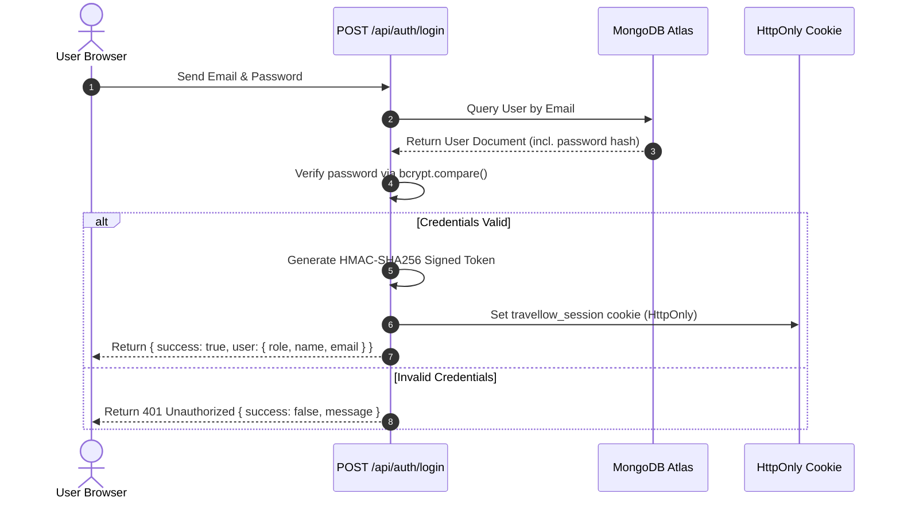
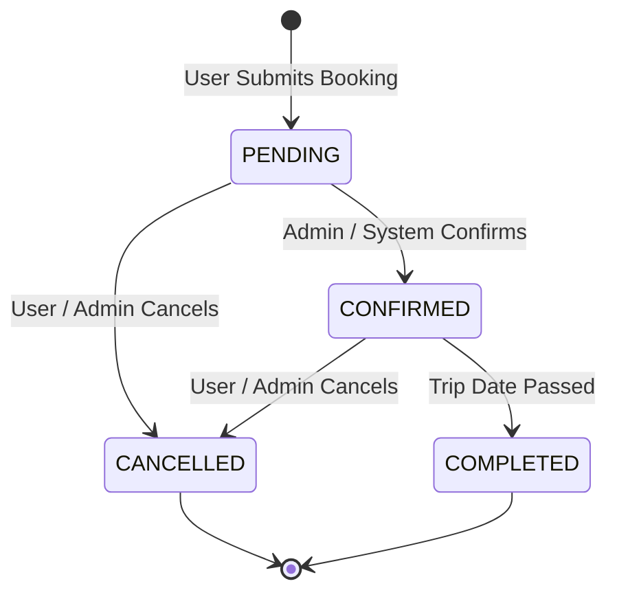
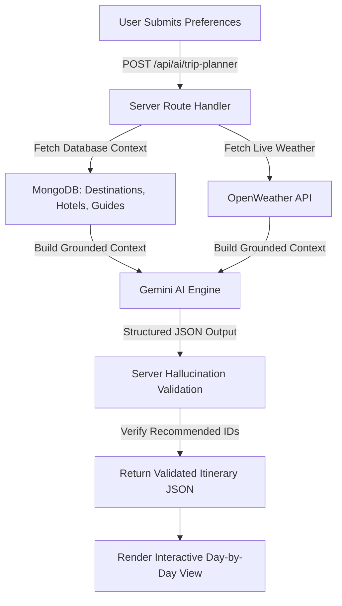
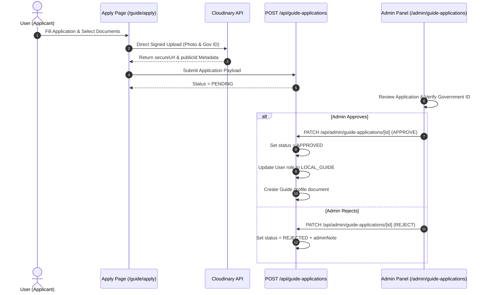
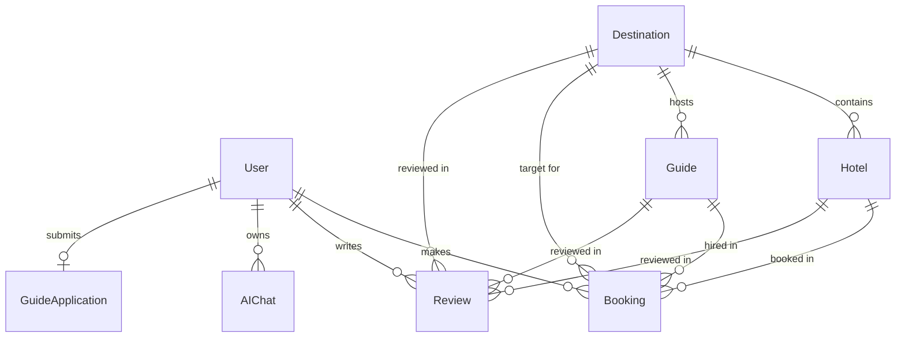

# TRAVELLOW PROJECT KNOWLEDGE & TECHNICAL SOURCE DOCUMENTATION

**Project Name**: Travellow  
**Full Project Title**: AI-Powered Smart Tour Guide and Travel Booking Platform  
**Academic Level**: MCA Mini Project (2026)  
**System Architecture**: Next.js 14 App Router Full-Stack Application  
**Primary Repository**: `Travellow`  

---

## 1. PROJECT OVERVIEW

### 1.1 Project Purpose
Travellow is a full-stack, AI-powered travel discovery, itinerary planning, and travel service booking platform. The project bridges destination exploration with real-time AI assistance, live weather integration, location mapping, and verified local tour guide services.

### 1.2 Target Users
1. **Travelers (Normal Users)**: Individuals seeking curated travel destinations, personalized AI itineraries, hotel stays, local tour guide bookings, and authentic user reviews.
2. **Local Guides**: Verified travel experts who offer personalized guiding services across specific destinations.
3. **Platform Administrators**: System managers responsible for content management, booking overviews, review moderation, and guide verification document audits.

### 1.3 Main Problem Addressed
- **Fragmented Travel Planning**: Travelers typically use multiple disconnected platforms for research, weather tracking, location mapping, hotel bookings, and tour guide hiring.
- **Generic / Unstructured Itineraries**: Conventional travel sites lack real-time context-aware planning that considers live weather and local guide availability.
- **Unverified Local Guides**: Travelers often struggle to find verified, authentic local guides with identity and document verification.

### 1.4 Proposed Solution
Travellow integrates all travel services into a single platform:
- **Google Gemini AI Integration**: Provides multi-turn conversational travel assistance (`/api/ai/chat`) and structured, day-by-day trip planning (`/api/ai/trip-planner`) grounded in verified MongoDB database context.
- **Cloudinary Identity Verification**: Enables guide applicants to securely upload government IDs and certificates for administrative review prior to approval.
- **Real-Time Weather & Location Mapping**: Integrates OpenWeather API and Google Maps JavaScript API with graceful fallbacks.
- **Unified Booking Engine**: Facilitates server-validated hotel night calculations and guide hourly rate bookings.

### 1.5 Project Scope & Implemented Capabilities
- **Authentication**: HTTP-only session cookie authentication signed with HMAC-SHA256 and bcrypt password hashing.
- **Catalog Management**: Dynamic destination catalog with region filtering (India, Asia, Europe), search indexing, and slug routing.
- **Stays & Local Guides**: Detailed hotel accommodations and local guide profiles with live review rating recalculations.
- **AI Ecosystem**: Dual AI interfaces (Full-page AI Trip Planner + Global Floating AI Chatbot).
- **Admin Control Panel**: Comprehensive CRUD administration for destinations, hotels, guides, users, bookings, reviews, and guide verification document workflows.

---

## 2. TECHNOLOGY STACK

| Technology | Version / Spec | Purpose | Application Location |
| :--- | :--- | :--- | :--- |
| **Next.js** | 14.2.15 (App Router) | Full-stack framework (SSR, SSG, Route Handlers) | Entire Application (`/app`) |
| **React** | 18.3.1 | User Interface Component Rendering | Frontend Components (`/components`) |
| **JavaScript** | ES2023 | Core Logic Programming Language | Client & Server Codebase |
| **Tailwind CSS** | 3.4.14 | Utility-First Responsive Styling & Design System | Styling (`app/globals.css`, `tailwind.config.js`) |
| **Framer Motion** | 11.11.10 | Fluid Micro-Animations & UI Transitions | Hero, Modals, Floating Chatbot |
| **Lucide React** | 0.453.0 | Modern Vector Icon System | UI Components & Admin Panel |
| **Node.js** | v22.x Runtime | Server Environment & API Execution | Next.js Server & Route Handlers |
| **MongoDB Atlas** | Cloud Database | NoSQL Document Database Storage | Persistent Data Store |
| **Mongoose** | 9.10.1 | Object Data Modeling (ODM) Schema Enforcement | Data Schemas (`/models`) |
| **bcryptjs** | 3.0.3 | One-way Cryptographic Password Hashing | Authentication (`lib/auth/session.js`) |
| **Google Gemini AI** | `@google/genai` 2.23.0 | AI Itinerary Generation & Multi-turn Chatbot | AI Services (`lib/ai/gemini.js`) |
| **Google Maps API** | `@vis.gl/react-google-maps` 1.10.0 | Interactive Map Tiles, Markers, and InfoWindows | Location Map (`components/maps/DestinationMap.js`) |
| **OpenWeather API** | OpenWeatherMap REST API | Real-Time Weather Conditions & Forecast Data | Weather Integration (`app/api/weather/route.js`) |
| **Cloudinary SDK** | `cloudinary` 2.11.0 | Cloud File Storage & Signed Upload Signatures | Verification Uploads (`lib/cloudinary.js`) |

---

## 3. SYSTEM ARCHITECTURE

### 3.1 High-Level Architecture Overview

```mermaid
graph TD
    Client[User Browser / Client UI] -->|HTTP Requests| NextApp[Next.js 14 App Router]
    
    subgraph Frontend Layer
        NextApp --> UIComponents[React Components & Pages]
        UIComponents --> FloatingChat[Global Floating AI Chatbot]
        UIComponents --> MapsComp[Google Maps Component]
    end
    
    subgraph Server Layer
        NextApp --> APIRoutes[Next.js API Route Handlers]
        APIRoutes --> AuthMiddleware[HMAC Session Authentication]
    end
    
    subgraph External & Database Services
        APIRoutes -->|Mongoose ODM| MongoDB[(MongoDB Atlas)]
        APIRoutes -->|@google/genai| GeminiAPI[Google Gemini AI API]
        APIRoutes -->|HTTP REST| WeatherAPI[OpenWeather API]
        APIRoutes -->|Signed Signatures| CloudinaryAPI[Cloudinary Storage]
        MapsComp -->|JS SDK| GoogleMaps[Google Maps Platform]
    end
```

### 3.2 Data & Communication Flow
1. **Client Request**: The client browser interacts with Next.js App Router pages built using React 18 client/server components.
2. **Server Middleware & Authentication**: Next.js route handlers inspect HTTP-only signed cookies (`travellow_session`) using Node.js `crypto` HMAC-SHA256 signature verification.
3. **Database Integration**: Server-side functions execute MongoDB Atlas operations via Mongoose ODM models with connection pooling (`readyState === 1`).
4. **AI & External Services**: Server route handlers construct grounded contexts from MongoDB and make outbound calls to Google Gemini AI API, OpenWeather API, and Cloudinary APIs.

---

## 4. USER ROLES

### 4.1 Role Matrix

| Capability / Resource | USER (Traveler) | LOCAL_GUIDE | ADMIN |
| :--- | :---: | :---: | :---: |
| Browse Destinations & Maps | Yes | Yes | Yes |
| Access AI Trip Planner & Chatbot | Yes | Yes | Yes |
| Create Hotel & Guide Bookings | Yes | Yes | Yes |
| Cancel Own Active Bookings | Yes | Yes | Yes |
| Post & Edit Own Reviews | Yes | Yes | Yes |
| Submit Guide Application | Yes | N/A | N/A |
| Access Guide Status Dashboard | Yes | Yes | Yes |
| Access Admin Control Panel | **No** | **No** | **Yes** |
| Verify Guide Documents | **No** | **No** | **Yes** |
| Approve / Reject Guide Applicants | **No** | **No** | **Yes** |
| Admin CRUD (Destinations, Hotels, etc.) | **No** | **No** | **Yes** |

### 4.2 Role Descriptions
- **USER**: Default role assigned upon registration. Can explore destinations, view weather/maps, generate AI itineraries, book hotels/guides, leave reviews, and apply to become a local guide.
- **LOCAL_GUIDE**: Upgraded role granted automatically when an administrator approves a `GuideApplication` with a verified Government ID.
- **ADMIN**: System management role. Has exclusive access to `/admin/*` management views, document verification tools, and platform content CRUD operations.

---

## 5. AUTHENTICATION

### 5.1 Architecture & Token Specs
- **Password Hashing**: `bcryptjs` with salt rounds = 10 (`hashPassword` / `comparePassword`).
- **Session Token**: Custom Base64URL-encoded JSON payload signed with HMAC-SHA256 using `AUTH_SECRET`.
- **Payload Structure**: `{ id, email, name, role, country, preferredCurrency, exp }`.
- **Cookie Parameters**:
  - Name: `travellow_session`
  - Attributes: `httpOnly: true`, `sameSite: "lax"`, `path: "/"`, `maxAge: 7 days`.
  - Production Flag: `secure: process.env.NODE_ENV === "production"`.
- **Request Deduplication**: `getCurrentUser` is wrapped in React's `cache()` to eliminate redundant MongoDB lookups per render pass.

### 5.2 Authentication Flow



---

## 6. PUBLIC WEBSITE MODULES

| Route | Purpose | Key Features | Primary APIs / Components |
| :--- | :--- | :--- | :--- |
| `/` | Home Landing Page | Video-inspired Hero, Region Grid, Hotels, Guides, AI Showcase, How It Works | `Hero`, `PopularDestinations`, `HotelsSection`, `GuidesSection`, `AIPlannerSection` |
| `/destinations` | Catalog Exploration | Search, Region Filter (India, Asia, Europe), View Toggles (Grid, Split, Map) | `DestinationCard`, `DestinationMap`, `/api/destinations` |
| `/destinations/[slug]` | Destination Details | Overview, Weather, Maps, Stays, Guides, Customer Reviews, Review Form | `/api/destinations/[slug]`, `/api/weather`, `HotelBookingModal` |
| `/hotels` | Hotel Stays Catalog | Hotel listings, rating badges, price display, direct booking trigger | `HotelBookingModal`, `/api/hotels` |
| `/guides` | Local Guides Catalog | Verified guide profiles, specialties, hourly rates, booking trigger | `GuideBookingModal`, `/api/guides` |
| `/trip-planner` | AI Trip Planner | Preferences form, live OpenWeather integration, Gemini itinerary generator | `/api/ai/trip-planner`, `FormatChatMessage` |
| `/sign-in` | Account Sign In | Email & Password login, role-based redirect (`/admin` vs `/dashboard`) | `/api/auth/login` |
| `/sign-up` | Registration | New user registration form, currency selector, account-type intent | `/api/auth/register` |
| `/guide/apply` | Guide Application | Multi-step form, Cloudinary document upload (Government ID, Certificates) | `/api/guide-applications`, `/api/guide-applications/upload-signature` |
| `/dashboard` | User Dashboard | Personal booking management, active/past stays, guide application status card | `/api/bookings`, `/api/guide-applications/me` |

---

## 7. DESTINATION MODULE

### 7.1 Data Structure & Fields
The `Destination` schema (`models/Destination.js`) enforces:
- `name`, `country`, `region` (`INDIA` | `ASIA` | `EUROPE`)
- `slug` (Unique, indexed, lowercase)
- `description`, `shortDescription`
- `image`, `gallery` (Array of image URLs)
- `rating` (0 to 5), `reviewCount`
- `startingPrice`, `currency` (`INR`, `USD`, `AED`, `EUR`, `GBP`, `JPY`)
- `bestTimeToVisit`, `activities`, `highlights`
- `latitude`, `longitude` (Numeric coordinates for Google Maps)

### 7.2 API Endpoint & Routing
- `GET /api/destinations`: Accepts optional query parameters `?region=...`, `?search=...`, and `?featured=true`. Uses `.lean()` for performance.
- `GET /api/destinations/[slug]`: Resolves destination by unique `slug` or ObjectId string. Returns destination details alongside related hotels and local guides.

---

## 8. HOTEL MODULE

### 8.1 Data Structure & Fields
The `Hotel` schema (`models/Hotel.js`) enforces:
- `name`, `destination` (ObjectId ref to `Destination`)
- `country`, `description`, `image`, `gallery`
- `rating` (default 4.5), `reviewCount`
- `pricePerNight`, `currency`
- `amenities` (Array of strings e.g. `["Wifi", "Pool", "Spa"]`)
- `address`, `latitude`, `longitude`
- `featured`, `aiEligible` (Boolean flags for AI recommendation engine)

### 8.2 Hotel Booking Flow & Server Calculation
1. User selects Check-in (`startDate`) and Check-out (`endDate`) dates and guest count in `HotelBookingModal`.
2. Request is dispatched to `POST /api/bookings` with `{ bookingType: "HOTEL", hotelId, startDate, endDate, guests }`.
3. Server calculates:
   $$\text{nights} = \left\lceil \frac{\text{endDate} - \text{startDate}}{86400000} \right\rceil$$
   $$\text{totalAmount} = \text{nights} \times \text{hotel.pricePerNight}$$
4. Client cannot manipulate prices or total amounts.

---

## 9. LOCAL GUIDE MODULE

### 9.1 Data Structure & Fields
The `Guide` schema (`models/Guide.js`) enforces:
- `name`, `destination` (ObjectId ref to `Destination`)
- `country`, `bio`, `profileImage`
- `languages` (Array e.g. `["English", "Hindi"]`), `specialties`
- `rating` (default 4.9), `reviewCount`
- `hourlyRate`, `currency`
- `verified` (Boolean flag), `experienceYears`

### 9.2 Guide Booking Flow
1. User selects tour date (`startDate`), duration in hours (`hours`), and guest count in `GuideBookingModal`.
2. Request is dispatched to `POST /api/bookings` with `{ bookingType: "GUIDE", guideId, startDate, hours, guests }`.
3. Server calculates:
   $$\text{totalAmount} = \text{hours} \times \text{guide.hourlyRate}$$

---

## 10. HOTEL & GUIDE BOOKING SYSTEM

### 10.1 Booking API Specification
- `POST /api/bookings`: Creates a new reservation (`HOTEL` or `GUIDE`). Requires user authentication. Calculates totals server-side. Sets initial status to `PENDING`.
- `GET /api/bookings`: Retrieves bookings for the authenticated user (or all bookings if caller is `ADMIN`). Populates `hotel`, `guide`, and `destination`.
- `PATCH /api/bookings/[id]`: Updates booking status. Enforces ownership check (users can only cancel their own pending/confirmed bookings).

### 10.2 Booking Status State Machine



---

## 11. REVIEW SYSTEM

### 11.1 Review Schema & Grounding
The `Review` schema (`models/Review.js`) links a `user` to either a `destination`, `hotel`, or `guide` with a `rating` (1–5) and optional `comment`.

### 11.2 Rating & Count Recalculation Algorithm
When a review is created (`POST /api/reviews`), updated (`PATCH /api/reviews/[id]`), or deleted (`DELETE /api/reviews/[id]`), the server triggers an aggregation pipeline:

$$\text{newRating} = \frac{\sum_{i=1}^{N} \text{rating}_i}{N}$$
$$\text{newReviewCount} = N$$

The target model (`Destination`, `Hotel`, or `Guide`) is updated in MongoDB immediately, keeping public ratings accurate.

---

## 12. AI TRIP PLANNER

### 12.1 Execution Pipeline



### 12.2 Grounding & Safety Constraints
1. **Context Grounding**: The server passes a `safeContext` object containing database entities and OpenWeather conditions to Gemini.
2. **ID Verification**: Recommended hotel and guide IDs returned by Gemini are cross-checked against actual MongoDB documents. Non-existent IDs are stripped to prevent hallucinated recommendations.
3. **No Financial Authority**: Gemini does NOT calculate final booking prices or execute bookings. All bookings must be submitted through `POST /api/bookings`.

---

## 13. AI TRAVEL ASSISTANT / CHATBOT

### 13.1 Floating UI Component
- **Location**: Global floating button at bottom-right (`fixed bottom-6 right-6`).
- **Suppression Routes**: Automatically hidden on `/admin/*`, `/sign-in`, `/sign-up`, and `/guide/apply`.
- **Popup Container**: `380px × 520px` desktop window (`70vh` mobile view) with dark styling.
- **Scroll Isolation**: Message list uses internal `overflow-y-auto` scroll containment to prevent page jumps.

### 13.2 Endpoint & Multi-Turn State
- **Endpoint**: `POST /api/ai/chat`.
- **Session Management**: Session ID (`sessionId`) is generated and returned on first message, persisting multi-turn conversation history in the `AIChat` MongoDB collection.
- **Unauthenticated Handling**: Logged-out users opening the popup see a prompt to **Sign In** or **Register**.

---

## 14. GOOGLE MAPS

### 14.1 Configuration & Components
- **Library**: `@vis.gl/react-google-maps` (v1.10.0).
- **Component**: `DestinationMap.js` (`components/maps/DestinationMap.js`).
- **Features**: Dynamic bounds fitter (`MapBoundsFitter`), custom markers, and InfoWindows displaying destination imagery, pricing, and links.
- **Fallback UI**: If the Google Maps API key is missing or authentication fails (`window.gm_authFailure`), the component switches to the *"Destination Map Preview"* fallback card, listing all destination coordinates cleanly.

---

## 15. WEATHER INTEGRATION

### 15.1 API Route & Response Normalization
- **Endpoint**: `GET /api/weather?lat=...&lon=...` or `?q=...`.
- **External Source**: OpenWeather REST API.
- **Output**: Returns temperature (°C), feels-like, humidity (%), wind speed (m/s), condition, and OpenWeather icon URL.
- **Graceful Failure**: If OpenWeather is unavailable, the UI falls back smoothly without breaking destination pages or AI itinerary generation.

---

## 16. GUIDE APPLICATION WORKFLOW

### 16.1 Lifecycle



---

## 17. CLOUDINARY DOCUMENT VERIFICATION

### 17.1 Signed Upload Architecture
1. Client calls `POST /api/guide-applications/upload-signature` with `{ folder, uploadPreset, documentType }`.
2. Server generates a signed Cloudinary signature using `CLOUDINARY_API_SECRET`.
3. Client uploads file directly to Cloudinary (`https://api.cloudinary.com/v1_1/.../upload`).
4. Metadata (`publicId`, `secureUrl`, `fileName`, `fileSize`, `resourceType`) is submitted with the application.

### 17.2 Document Types & Approval Guard
- **Document Types**: `GOVERNMENT_ID` (Required), `PROFILE_PHOTO` (Required), `EXPERIENCE_CERTIFICATE` (Optional), `TOURISM_CERTIFICATE` (Optional), `GUIDE_LICENSE` (Optional), `LANGUAGE_CERTIFICATE` (Optional).
- **Approval Guard**: The admin approval API strictly rejects approval requests if the applicant's `GOVERNMENT_ID` status is not `VERIFIED`.

---

## 18. ADMIN PANEL

### 18.1 Route Overview & Access Control
All routes under `/admin/*` are restricted to users with `role === "ADMIN"`.

| Admin Route | Purpose | Key Operations |
| :--- | :--- | :--- |
| `/admin` | Main Dashboard | Platform metrics (Users, Bookings, Revenue, Pending Applications) |
| `/admin/destinations` | Destinations Management | Create, Edit, Delete destinations, slug management |
| `/admin/hotels` | Hotels Management | Create, Edit, Delete hotels, destination mapping |
| `/admin/guides` | Guides Management | Create, Edit, Delete guides, rate configuration |
| `/admin/users` | User Management | Role updates (`USER`, `LOCAL_GUIDE`, `ADMIN`), search, filter |
| `/admin/bookings` | Bookings Management | System-wide booking status modification |
| `/admin/reviews` | Reviews Management | Moderation and deletion of customer reviews |
| `/admin/guide-applications` | Applications Review | Document inspection, document verification, application approval/rejection |

---

## 19. DATABASE DESIGN

### 19.1 Entity Relationship Diagram



---

## 20. API DOCUMENTATION

| Method | Endpoint | Auth Required | Role | Purpose |
| :--- | :--- | :---: | :---: | :--- |
| `POST` | `/api/auth/register` | No | Public | Register new user account |
| `POST` | `/api/auth/login` | No | Public | Authenticate user & issue HttpOnly cookie |
| `POST` | `/api/auth/logout` | No | Public | Clear session cookie |
| `GET` | `/api/auth/me` | Yes | Any | Return current authenticated user profile |
| `GET` | `/api/destinations` | No | Public | List destinations (with search & region filters) |
| `GET` | `/api/destinations/[slug]` | No | Public | Get destination details, hotels, guides |
| `GET` | `/api/hotels` | No | Public | List hotels |
| `GET` | `/api/guides` | No | Public | List local guides |
| `POST` | `/api/bookings` | Yes | Any | Create hotel or guide booking |
| `GET` | `/api/bookings` | Yes | Any | Get user bookings (or all if Admin) |
| `PATCH` | `/api/bookings/[id]` | Yes | Any | Cancel active booking |
| `POST` | `/api/reviews` | Yes | Any | Submit destination/hotel/guide review |
| `DELETE` | `/api/reviews/[id]` | Yes | Any/Admin| Delete review & recalculate average ratings |
| `POST` | `/api/ai/trip-planner` | Yes | Any | Generate AI trip itinerary |
| `POST` | `/api/ai/chat` | Yes | Any | Send message to floating AI chatbot |
| `GET` | `/api/weather` | No | Public | Fetch live weather data |
| `POST` | `/api/guide-applications` | Yes | USER | Submit guide application |
| `GET` | `/api/guide-applications/me` | Yes | USER | Get applicant's own application status |
| `POST` | `/api/guide-applications/upload-signature` | Yes | USER | Generate Cloudinary upload signature |
| `GET` | `/api/admin/stats` | Yes | ADMIN | Fetch admin dashboard counters |
| `GET` | `/api/admin/guide-applications` | Yes | ADMIN | List pending/all guide applications |
| `PATCH` | `/api/admin/guide-applications/[id]` | Yes | ADMIN | Approve or Reject guide application |
| `PATCH` | `/api/admin/guide-applications/[id]/documents` | Yes | ADMIN | Verify or Reject application document |

---

## 21. SECURITY IMPLEMENTATION

- **Password Protection**: Passwords are hashed using `bcryptjs` (salt rounds = 10). Raw passwords are never stored or returned in API responses.
- **Session Protection**: HTTP-only, SameSite=Lax cookies signed with HMAC-SHA256 (`AUTH_SECRET`). Client-side scripts cannot access session tokens.
- **Authorization**: API endpoints enforce explicit role checks (`requireRole(["ADMIN"])`).
- **Server-Side Calculations**: Booking total amounts are computed server-side from database pricing models, preventing client tampering.
- **Secret Isolation**: Server keys (`MONGODB_URI`, `GEMINI_API_KEY`, `OPENWEATHER_API_KEY`, `CLOUDINARY_API_SECRET`, `NEXTAUTH_SECRET`) are strictly confined to Node.js runtime code.

---

## 22. ERROR HANDLING & RESILIENCE

- **Database Fallbacks**: Connection pooling (`readyState === 1`) handles database reconnection automatically.
- **Google Maps Fallback**: If key authentication fails or network is offline, `DestinationMap.js` renders the dark *"Destination Map Preview"* card.
- **Weather Fallback**: If OpenWeather API fails, destination pages load gracefully without weather badges.
- **AI Retry Mechanism**: `callGeminiWithRetry` automatically handles 503/429 errors with exponential backoff before surfacing friendly error messages.

---

## 23. RESPONSIVE DESIGN

- **Tested Breakpoints**: `375px`, `390px`, `430px`, `768px`, `1024px`, `1280px`, `1440px`.
- **Layout Adaptations**:
  - Desktop: Multi-column grids, split destination map view, sticky sidebar layout.
  - Mobile: Collapsible drawer navbar, single-column cards, full-width modal dialogs, responsive floating chatbot (`bottom-4 right-4`).

---

## 24. TESTING SUMMARY

- **Phase 1–10 Verification**:
  - Authentication flow: Tested & Verified.
  - Booking & Server-side calculations: Tested & Verified.
  - Review rating recalculation: Tested & Verified.
  - AI Trip Planner & Chatbot grounding: Tested & Verified.
  - Cloudinary document signature & upload: Tested & Verified.
  - Admin approval workflow: Tested & Verified.
  - Build validation (`npm run build`): **0 ERRORS** across 22 routes.

---

## 25. CURRENT DATABASE STATE (DEMO DATA)

The verified MongoDB Atlas collection counts for demonstration are:
- **Users**: 5
- **Destinations**: 14
- **Hotels**: 28
- **Guides**: 15
- **Bookings**: 9
- **Reviews**: 13
- **AIChats**: 19
- **GuideApplications**: 1

*Note: These numbers reflect the curated demo data state and do not represent hardcoded platform limits.*

---

## 26. PROJECT LIMITATIONS

1. **Payment Processing**: Live credit card / payment gateway processing is simulated (`PENDING` / `CONFIRMED` status transitions without real currency transaction processing).
2. **External Booking Engines**: Hotel and Guide availability relies on local MongoDB data rather than GDS or third-party hotel APIs.
3. **Google Maps Billing**: Live map tiles require an active Google Cloud Platform API key with billing enabled.

---

## 27. FUTURE ENHANCEMENTS

1. **Live Payment Gateway**: Integration of Razorpay or Stripe for real-time booking payments.
2. **Email & Push Notifications**: Automated booking confirmation emails via SendGrid / Nodemailer.
3. **Real-time Chat**: Socket.io / WebSockets integration for direct live chat between Travelers and Local Guides.
4. **Native Mobile App**: React Native / Flutter cross-platform companion app.

---

## 28. PROJECT COMPLETION STATUS

- **Core Capabilities**: 100% Implemented & Verified.
- **System Stability**: Verified clean production build (`npm run build` PASS with 0 errors).
- **Status**: Complete and stable for MCA project presentation, documentation, and final viva.
